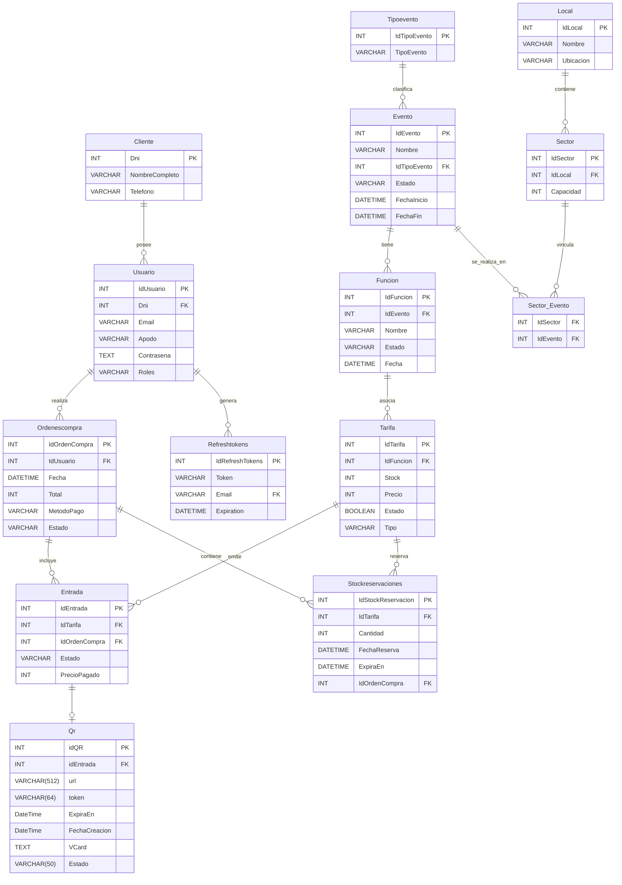

# DER

```mermaid
erDiagram
Cliente {
        INT Dni PK
        VARCHAR NombreCompleto
        VARCHAR Telefono
    }

    Usuario {
        INT IdUsuario PK
        INT Dni FK
        VARCHAR Email
        VARCHAR Apodo
        TEXT Contrasena
        VARCHAR Roles
    }

    Tipoevento {
        INT IdTipoEvento PK
        VARCHAR TipoEvento
    }

    Evento {
        INT IdEvento PK
        VARCHAR Nombre
        INT IdTipoEvento FK
        VARCHAR Estado
        DATETIME FechaInicio
        DATETIME FechaFin
    }

    Funcion {
        INT IdFuncion PK
        INT IdEvento FK
        VARCHAR Nombre
        VARCHAR Estado
        DATETIME Fecha
    }

    Local {
        INT IdLocal PK
        VARCHAR Nombre
        VARCHAR Ubicacion
    }

    Sector {
        INT IdSector PK
        INT IdLocal FK
        INT Capacidad
    }

    Sector_Evento {
        INT IdSector FK
        INT IdEvento FK
    }

    Tarifa {
        INT IdTarifa PK
        INT IdFuncion FK
        INT Stock
        INT Precio
        BOOLEAN Estado
        VARCHAR Tipo
    }

    Ordenescompra {
        INT IdOrdenCompra PK
        INT IdUsuario FK
        DATETIME Fecha
        INT Total
        VARCHAR MetodoPago
        VARCHAR Estado
    }

    Stockreservaciones {
        INT IdStockReservacion PK
        INT IdTarifa FK
        INT Cantidad
        DATETIME FechaReserva
        DATETIME ExpiraEn
        INT IdOrdenCompra FK
    }

    Entrada {
        INT IdEntrada PK
        INT IdTarifa FK
        INT IdOrdenCompra FK
        VARCHAR Estado
        INT PrecioPagado
    }

    Qr {
        INT idQR PK
        INT idEntrada FK
        VARCHAR(512) url
        VARCHAR(64) token
        DateTime ExpiraEn
        DateTime FechaCreacion
        TEXT VCard
        VARCHAR(50) Estado
    }

    Refreshtokens {
        INT IdRefreshTokens PK
        VARCHAR Token
        VARCHAR Email FK
        DATETIME Expiration
    }

    %% Relaciones
    Cliente ||--o{ Usuario : posee
    Usuario ||--o{ Ordenescompra : realiza
    Usuario ||--o{ Refreshtokens : genera

    Tipoevento ||--o{ Evento : clasifica
    Evento ||--o{ Funcion : tiene
    Funcion ||--o{ Tarifa : asocia

    Local ||--o{ Sector : contiene
    Sector ||--o{ Sector_Evento : vincula
    Evento ||--o{ Sector_Evento : se_realiza_en

    Tarifa ||--o{ Entrada : emite
    Tarifa ||--o{ Stockreservaciones : reserva

    Ordenescompra ||--o{ Entrada : incluye
    Ordenescompra ||--o{ Stockreservaciones : contiene

    Entrada || -- o| Qr : ""
```
# Diagrama UML

```mermaid
classDiagram
    direction LR

    %% ===================== ENTIDADES =====================

    class Cliente {
        +int DNI
        +string nombreCompleto
        +string Telefono
    }

    class Usuario {
        +int idUsuario
        +string Apodo
        +string Email
        +string Contrasena
        +ERoles Role
    }

    class RefreshToken {
        +int Id
        +string Token
        +string Email
        +DateTime Expiration
    }

    class OrdenesCompra {
        +int idOrdenCompra
        +DateTime Fecha
        +int Total
        +EMetodoPago metodoPago
        +EEstados Estado
    }

    class Entrada {
        +int idEntrada
        +EEstados Estado
        +int PrecioPagado
    }

    class Tarifa {
        +int idTarifa
        +int Stock
        +int Precio
        +bool Estado
        +string Tipo
    }

    class Eventos {
        +int idEvento
        +string Nombre
        +int idTipoEvento
        +DateTime fechaInicio
        +DateTime fechaFin
        +EEstados EstadoEvento
    }

    class TipoEvento {
        +int idTipoEvento
        +string tipoEvento
    }

    class Funcion {
        +int idFuncion
        +string Nombre
        +DateTime Fecha
        +EEstados Estado
    }

    class Local {
        +int idLocal
        +string Nombre
        +string Ubicacion
    }

    class Sector {
        +int idSector
        +byte Capacidad
    }
    class QR {
        +int idQR
        +int idEntrada
        +string url
        +string? token
        +DateTime ExpiraEn
        +DateTime FechaCreacion
        +string VCard
        +EEstados Estado
        +QR()
        +QR(idEntrada, url, ExpiraEn, vCard, token, estado)
    }

    

    %% ===================== ENUMS =====================

    class EEstados {
        <<enumeration>>
        Creado
        Pagado
        Pendiente
        Publicado
        Cancelado
        Expirada
        Activo
        Inactivo
        Anulada
        Usado
    }

    class EMetodoPago {
        <<enumeration>>
        Efectivo
        Cheques
        Credito
        Debito
        Transferencia
        BilleteraDigital
        NFC
        QR
    }

    class ERoles {
        <<enumeration>>
        Admin
        Usuario
    }

    class ETipoEvento {
        <<enumeration>>
        Formales
        Informales
        Externos
        Internos
        Corporativos
        Empresariales
        Sociales
        Ocio
        Entretenimiento
        Deportivos
        Causa
        Politicos
        Religiosos
        Formativos
        Virtuales
        Hibridos
    }

    class ETipoTarifa {
        <<enumeration>>
        General
        Prensa
        Vip
        Descuento
        Gratuito
        Donada
    }

    %% ===================== INTERFACES DE REPOSITORIO =====================

    class IAdo {
        <<interface>>
        +IDbConnection GetDbConnection()
    }

    class IRepoCliente {
        <<interface>>
        +Task<IEnumerable<Cliente>> ObtenerTodos()
        +Task<Cliente?> ObtenerPorId(int id)
        +Task<int> InsertCliente(Cliente cliente)
        +Task<bool> UpdateCliente(Cliente cliente)
        +Task<bool> DeleteCliente(int id)
        +Task<IEnumerable<Entrada>> ObtenerEntradasPorCliente(int id)
        +Task<bool> ExistePorDNI(int dni)
    }

    class IRepoEntrada {
        <<interface>>
        +Task<IEnumerable<Entrada>> ObtenerTodos()
        +Task<int> InsertEntrada(Entrada entrada)
        +Task<bool> DeleteEntrada(int id)
        +Task<Entrada?> ObtenerEntrada(int id)
        +Task<string> AnularEntrada(int id)
    }

    class IRepoEvento {
        <<interface>>
        +Task<IEnumerable<Eventos>> ObtenerTodos()
        +Task<Eventos?> ObtenerEventoPorId(int id)
        +Task<TipoEventoDto?> ObtenerTipoEventoPorNombre(string tipo)
        +Task<Eventos?> ObtenerEventoPorNombre(string nombre)
        +Task<int> InsertEvento(Eventos evento)
        +Task<bool> UpdateEvento(Eventos evento)
        +Task<bool> DeleteEvento(int id)
        +Task<IEnumerable<Funcion>> ObtenerFuncionesPorEvento(int idEvento)
        +Task<string> PublicarEvento(int id)
        +Task<string> CancelarEvento(int id)
    }

    class IRepoFuncion {
        <<interface>>
        +Task<IEnumerable<Funcion>> ObtenerTodos()
        +Task<Funcion?> ObtenerPorId(int id)
        +Task<int> InsertFuncion(Funcion funcion)
        +Task<bool> UpdateFuncion(Funcion funcion)
        +Task<bool> DeleteFuncion(int id)
        +Task<IEnumerable<Tarifa>> ObtenerTarifasDeFuncion(int id)
        +Task<string> CancelarFuncion(int id)
        +Task<EEstados> ObtenerEstadoFuncion(string estadoFuncion)
    }

    class IRepoLocal {
        <<interface>>
        +Task<IEnumerable<Local>> ObtenerTodos()
        +Task<Local?> ObtenerPorId(int id)
        +Task<Sector?> ObtenerSectorPorId(int id)
        +Task<int> InsertLocal(Local local)
        +Task<bool> UpdateLocal(Local local)
        +Task<bool> DeleteLocal(int id)
        +Task<IEnumerable<Sector>> ObtenerSectoresDelLocal(int id)
        +Task<int> InsertSector(Sector sector, int id)
        +Task<bool> UpdateSector(Sector sector, int id)
        +Task<bool> DeleteSector(int id)
    }

    class IRepoOrdenCompra {
        <<interface>>
        +Task<int> InsertOrdenCompra(OrdenesCompra ordenesCompra)
        +Task<OrdenesCompra?> ObtenerOrdenCompra(int id)
        +Task<IEnumerable<OrdenesCompra>> ObtenerOrdenesCompra()
        +Task<string> PagarOrdenCompra(int id)
        +Task<string> CancelarOrdenCompra(int id)
        +EMetodoPago ObtenerMetodoPago(string metodo)
        +EEstados ObtenerEstado(string estadoOC)
        +Task<int> LiberarStockExpirado()
        +Task<string> InsertStockReservaciones(StockReservaciones stockReservaciones)
        +Task<IEnumerable<StockReservaciones>> ObtenerReservacionesPorIdOrden(int idOrden)
    }

    class IRepoRefreshToken {
        <<interface>>
        +Task<int> InsertToken(RefreshToken token)
        +Task<RefreshToken?> ObtenerToken(string token)
        +Task DeleteToken(string token)
        +Task DeleteTokensPorEmail(string email)
        +Task ReemplazarToken(int idUsuario, string nuevoHash, DateTime expiracion)
    }

    class IRepoQR {
        +Task<int> InsertQR(QR qr)
        +Task<QR?> ObtenerQRPorEntrada(int idEntrada)
        +Task<QR?> ObtenerQRPorToken(string token)
    }

    class IRepoTarifa {
        <<interface>>
        +Task<IEnumerable<Tarifa>> ObtenerTodos()
        +Task<Tarifa?> ObtenerPorId(int id)
        +Task<int> InsertTarifa(Tarifa tarifa)
        +Task<bool> UpdateTarifa(Tarifa tarifa)
        +Task<bool> ReducirStock(int id)
        +ETipoTarifa ObtenerTipoTarifa(string tipo)
    }

    class IRepoUsuario {
        <<interface>>
        +Task<IEnumerable<Usuario>> ObtenerTodos()
        +Task<Usuario?> ObtenerPorId(int id)
        +Task<int> InsertUsuario(Usuario usuario)
        +Task<bool> UpdateUsuario(Usuario usuario)
        +Task<bool> DeleteUsuario(int id)
        +Task<IEnumerable<OrdenesCompra>> ObtenerComprasPorUsuario(int id)
        +Task<Usuario?> ObtenerPorEmail(string nuevoEmail)
        +Task<bool> ExisteUsuarioPorEmail(string nuevoEmail)
    }

    %% ===================== RELACIONES =====================

    Usuario --> Cliente : tiene >
    Usuario --> OrdenesCompra : realiza >
    OrdenesCompra --> Entrada : contiene >
    Entrada --> Tarifa : usa >
    Entrada --> OrdenesCompra : pertenece a >
    Funcion --> Eventos : pertenece a >
    Eventos --> TipoEvento : clasificado como >
    Sector --> Local : ubicado en >
    QR --> Entrada : relacion

    %% Relación interfaces con entidades
    IRepoCliente ..> Cliente
    IRepoEntrada ..> Entrada
    IRepoEvento ..> Eventos
    IRepoFuncion ..> Funcion
    IRepoLocal ..> Local
    IRepoOrdenCompra ..> OrdenesCompra
    IRepoRefreshToken ..> RefreshToken
    IRepoTarifa ..> Tarifa
    IRepoUsuario ..> Usuario
    IRepoQR ..> QR : maneja


```